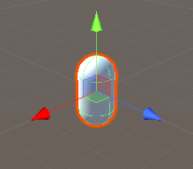
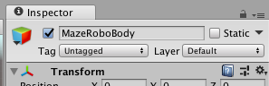

## Make a robot

Time to create your first object!

+ Make a **Capsule** object \(**GameObject > 3D Object > Capsule**\): this will be the body of MazeRobo, your robot!

  

+ Select the Capsule by clicking on it. On the right you should see loads of options and menus. This is called the **Inspector**, and it's where you set up most of the objects in your game.

You can rename an object by typing a new name in at the top of the Inspector.

+ Change the name of the Capsule to `MazeRobo` now.

  

+ Next, to be sure that MazeRobo is right in the middle of the game world, look in the **Transform** section of the Inspector, click on the cog icon, and choose **Reset**.

  

+ You need a couple more objects to make your robot, so create a **Cube** \(**GameObject > 3D Object > Cube**\) and a **Sphere** \(**GameObjects > 3D Object > Sphere**\).

+ Change the name of the Cube to `Shades`, and the name of the Sphere to `Nose`.

+ Look at the left of the screen. You should see a list of the objects in your game, including `MazeRobo`, `Shades`, and `Nose`. Click on `Shades` and drag it onto `MazeRobo`. Then drag `Nose` onto `MazeRobo` in the same way.

   

--- collapse ---
---
title: Dragging objects together
---

This puts the `Shades` and `Nose` objects 'inside' the `MazeRobo` object, so when they move, they move together.

Putting objects 'inside' other objects lets you build up complex objects \(like a game character!\) from simple ones like Cubes, Spheres, Capsules, etc.

--- /collapse ---

+ Now select the `Shades` object and look at the Inspector's **Transform** section. You will see a set of three **coordinates**  \(X, Y, Z\) that control the object's **Position**.

+ Try changing each of the coordinates' value to see which direction they control. Try putting a `-` in front of some of the numbers too! Finally, set them to these values:
```
   X = 0
   Y = 0.64
   Z = 0.42
```
  

+ Do the same for `Nose`, setting them like this:
```
    X = 0
    Y = 0.5
    Z = 0.5
```
This doesn't quite look like anything yet, does it? To make MazeRobo look like a robot, you'll adjust what `Shades` and `Nose` look like. You can control the shape of objects with the **Scale** controls.

+ Staying in the **Inspector**, look at the scale controls for `Shades`. Set its scale to these values:
```
    X = 0.64
    Y = 0.16
    Z = 0.16
```
  

+ Now set the `Nose` scale to:
```
    X = 0.16
    Y = 0.16
    Z = 0.16
```
Now it's starting to look like a robot!

  

In the next step, it's time to add some colour!
