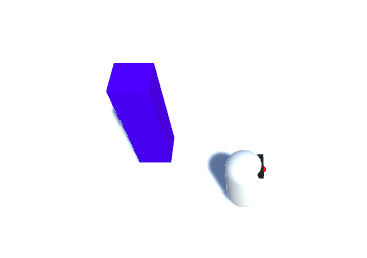

## Camera tracking

MazeRobo moves, but right now the camera always stays in the same place. That's going to be a problem if you try to add anything outside of the camera's initial field of vision, or anything that moves outside it (like MazeRobo itself!). Let's make it adjust!

+ Select the **Main Camera** in the Hierarchy and set its **Transform** properties in the Inspector as follows:

  


  ### Position
  ```
  X: 0
  Y: 9
  Z: -5
  ```

  ### Rotation
  ```
  X: 60
  Y: 0
  Z: 0
  ```

  ### Scale
  ```
  X: 1
  Y: 1
  Z: 1
  ```


Now you've changed the camera's angle (run the game to test it if you like!), but it still doesn't follow MazeRobo.

To make that happen, you'll have to update the camera's location every frame, and for that, you'll need another script!

+ Create a new script (**Assets > Create > C# Script**) and call it `CameraMover`. Put it in the `Scripts` folder.

+ At the start of the script, just inside the `CameraMover` **class**, add three **variables** like so:

```cs
  public class CameraMover : MonoBehaviour {

    public Transform tf;
    public Transform playerTransform;
    public Vector3 distanceBetweenPlayerAndCam;      
```

--- collapse ---
---
title: What does the new code do?
---

These lines of code track:
+ The position of the camera (`tf`)
+ The position of MazeRobo (`playerTransform`)
+ The distance, in (X, Y, Z), from MazeRobo to the camera (`distanceBetweenPlayerAndCam`)

--- /collapse ---

+ Now you need to set the initial distance between MazeRobo and the camera as the one you want to keep. Do this inside the `Start` function like so:

```cs
  void Start () {
    distanceBetweenPlayerAndCam = tf.position - playerTransform.position;
  } 
```

+ Next, ensure that the game keeps that distance the same in every frame of the game by adding a line to the `Update` function like so:

```cs
  void Update () {
    tf.position = playerTransform.position + distanceBetweenPlayerAndCam;
  }
```

+ You need to attach the script to the camera now, so go back to Unity and select the Main Camera in the Hierarchy. Then drag the `CameraMover` script from the Project space onto the Main Camera.

+ Find the **CameraMover** field in the Inspector, and drag the Main Camera from the Hierarchy into the **Tf** field. Then drag MazeRobo from the Hierarchy into the **Player Transform** field.


+ Now run the game and watch the camera follow MazeRobo around!


