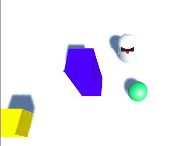

## परिचय

इस परियोजना में आप अपना पहला गेम यूनिटी के साथ बनाएंगे, जो एक पेशेवर गेम डेवलपमेंट प्लेटफॉर्म है।

### आप क्या बनाएँगे

आप एक रोबोट, एक गेंद और एक भूलभुलैया के साथ एक सरल वीडियो गेम बनाने जा रहे हैं, और आप उन उपकरणों को सीखेंगे जिनका उपयोग आप गेम को जयादा बड़ा और जयादा बढ़िया बनाने के लिए कर सकते हैं!

--- collapse ---
---
title: आप क्या सीखेंगे
---

+ 3D ऑब्जेक्ट कैसे बनाएं
+ वस्तुओं का रंग, आकार और स्थिति कैसे बदलें
+ कैसे खेल में एक खिलाड़ी का पालन करने के लिए कैमरा कोण समायोजित करें
+ किसी ऑब्जेक्ट में स्क्रिप्ट कैसे जोड़ें तथा गति और व्यवहार को नियंत्रित करने के लिए कोड लिखें

--- /collapse ---

--- collapse ---
---
title: आपको किन चीज़ों की आवश्यकता होगी
---

### हार्डवेयर

+ एक कंप्यूटर (या तो Windows या macOS) जो यूनिटी को चलाने में सक्षम हो

### सॉफ्टवेयर

+ आपको यूनिटी इंस्टॉल करने और इसे अपने कंप्यूटर पर सेट अप करने की आवश्यकता होगी। इसमें कुछ समय लग सकता है, क्योंकि यह एक बड़ा सॉफ्टवेयर है।

--- /collapse ---

--- collapse ---
---
title: यूनिटी कैसे प्राप्त करें
---

+ [Dojo.soy/getunity](http://dojo.soy/getunity) पर जाएं और **डाउनलोड इंस्टॉलर** बटन पर क्लिक करें।
+ इंस्टॉलर प्रोग्राम को एक बार डाउनलोड करने के बाद रन करें, और सभी डिफ़ॉल्ट विकल्पों को स्वीकार करते हुए, ऑन-स्क्रीन निर्देशों का पालन करें।
+ डाउनलोड और इंस्टॉल चरणों के पूरा होने की प्रतीक्षा करें।
+ एक बार यूनिटी सॉफ्टवेयर इंस्टॉल हो जाने पर, आपको एक खाता बनाना होगा (या साइन इन करें यदि आपके पास पहले से ही खाता है)। यह इसलिये है कि आप नि: शुल्क संस्करण का उपयोग कर सके, जो व्यक्तिगत उपयोग के लिए है।

--- /collapse ---

### शिक्षकों के लिए अधिक जानकारी

अगर आपको इस प्रोजेक्ट को प्रिंट करने की आवश्यकता है, तो कृप्या [प्रिंटर-अनुकूल संस्करण](https://projects.raspberrypi.org/en/projects/project-name/print){:target="_blank"} का उपयोग करें।

इस परियोजना का GitHub रिपॉजिटरी प्राप्त करने के लिए फुटर में दिए लिंक का उपयोग करें, जिसमें 'en/resources' फोल्डर में सभी संसाधन (तैयार परियोजना के उदाहरण सहित) हैं।