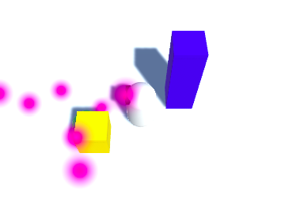

## जीतना!

आपको एक रोबोट मिला है, आपको एक गेंद मिली है... अब एक खेल होने के लिए, जीतने का तरीका होना चाहीये! अब आप इसे जोड़ देंगे।

+ सबसे पहले, एक और क्यूब जोड़ें और इसे `WinZone` कहें। शायद इसे एक नया, ध्यान देने योग्य रंग दे (पीला? नारंगी? गुलाबी?)।

+ सुनिश्चित करें कि आपके पास पदानुक्रम में `WinZone` चयनित है, और **Box Collider** में इंस्पेक्टर में **Is Trigger** विकल्प का चयन करें।


+ `WinZone` की **Transform Position** गुण सेट करें ताकि यह हो:
  ```
  X: -5
  Y: 1
  Z: -2
  ```
जब आप `Ball` छूते हैं तो `WinZone` को इसका पता चलने के लिए आप एक और स्क्रिप्ट लिखने जा रहे हैं। ऐसा करने के लिए में, जरूरत है गेंद **tagged** करने की।

+ पदानुक्रम में `Ball` चयन करें, और **Inspector** में उसके नाम के तहत **Tag** फ़ील्ड का चयन करें।


+ **Add Tag..** चुनें, फिर **+** आइकन पर क्लिक करें और 'ball' टैग बनाएं।

 


+ पदानुक्रम में `Ball` को फिर से चुनें, **Tag** फ़ील्ड को फिर से चुनें, और 'Ball' टैग चुनें जिसे आपने अभी बनाया है।


जब आप इस पर हैं, तो खिलाड़ी को यह बताने के लिए कि वे जीते हैं कुछ उत्सव क्यों नहीं जोड़ते!

+ एक **Particle System** (**GameObject > Effects > Particle System**) बनाएं और इसे `Fireworks`कहें।

+ `Fireworks` ऑब्जेक्ट का चयन करें और इंस्पेक्टर में उसके नाम के साथ बॉक्स को अचयनित करें। यह ऑब्जेक्ट छुपाता है, इसलिए एक बार आप पटाखे शुरू करने के लिए तैयार हो तब फिर इसे प्रकट कर सकते हैं!


+ अब इंस्पेक्टर में सेटिंग्स की सूची देखें, **Start Color** प्रारंभ करें और इसे पीले, या हरे, या जो भी आपको वास्तव में पसंद है, उसे सेट करें!

+ अंत में, `Fireworks` की **position** को `WinZone` की **Position** से मिलाएं।

अब आप सही समय आने पर आतिशबाजी बनाने के लिए कोड जोड़ देंगे!

+ `WinZone` नामक एक C# स्क्रिप्ट ( `Scripts` फ़ोल्डर में) बनाएँ। नई स्क्रिप्ट खोलें और `Start` और `Update` फ़ंक्शन को हटा दें। इस कोड को इसके अंदर रखें:

```cs
public GameObject fireworks;

void OnTriggerEnter (Collider col) {
  if (col.transform.CompareTag ("Ball")) {
    fireworks.SetActive (true);
  }
}
```

--- collapse ---
---
title: नया कोड क्या करता है?
---

यहां क्या हो रहा है कि `fireworks` नामक एक गेम ऑबजेक्ट बनाया गया है (आप इसे एक पल में अपने `Fireworks` से कनेक्ट करेंगे), और फिर स्क्रिप्ट इंतजार कर रही है किसी भी **Rigidbody** के **कोलाइडर** ऑब्जेक्ट को छूने के लिए (जो भी आप स्क्रिप्ट पर खींचते हैं - इस मामले में वह `WinZone`) होगा।

**Rigidbody** जो इससे टकराया था, वह स्वतः **Collider** वेरियबल `col`को सौंपा जाएगा। यदि उस **Rigidbody** पर 'Ball' का टैग होता है, तो `fireworks` ऑब्जेक्ट दिखाई देंगे।

--- /collapse ---

+ स्क्रिप्ट में परिवर्तन सहेजें और यूनिटी में वापस जाएं।

+ पदानुक्रम में `WinZone` पर स्क्रिप्ट खींचें और फिर `WinZone` चयनित के साथ, इंस्पेक्टर के **WinZone** अनुभाग में **Fireworks** फ़ील्ड में `Fireworks` ऑब्जेक्ट को Hierarchy से खींचें।


+ गेम को सहेजें, इसे चलाएं और `Ball` को `Winzone` में रखे। देखते हैं क्या होता है!



यह खेल के सभी बुनियादी टुकड़े है!

--- challenge ---

## चुनौती: रोबोट के लिए एक भूलभुलैया बनाओ

अब, आपके रोबोट को 'MazeRobo' कहा जाता है, इसलिए संभवतः भूलभुलैया होनी चाहिए!

+ आपको एक दीवार मिल गई है, इसलिए कुछ और क्यूब्स जोड़ें, कुछ दीवारों के निर्माण के लिए उनकी **Position** और **Scale** के साथ खेलें!

+ अपने खिलाड़ी को एक वास्तविक चुनौती दें: `WinZone` थोड़ा इधर-उधर करें, ताकि इसे प्राप्त करना कठिन हो!

+ यदि आप किसी और को जानते हैं जो इस खेल को बना रहा है, तो एक स्वैप करने की कोशिश करें कि क्या आप एक दूसरे के मेज़ों को हरा सकते हैं!

--- /challenge ---


***
इस परियोजना का अनुवाद स्वयंसेवकों ने किया:

शिल्पा मिश्रा

Rahul Singh

स्वयंसेवकों को धन्यवाद, हम दुनिया भर के लोगों को अपनी भाषा में सीखने का मौका दे सकते हैं। आप स्वेच्छा से अधिक लोगों तक पहुँचने में मदद कर सकते हैं - [rpf.io/translate](https://rpf.io/translate) पर अधिक जानकारी प्राप्त करें।
