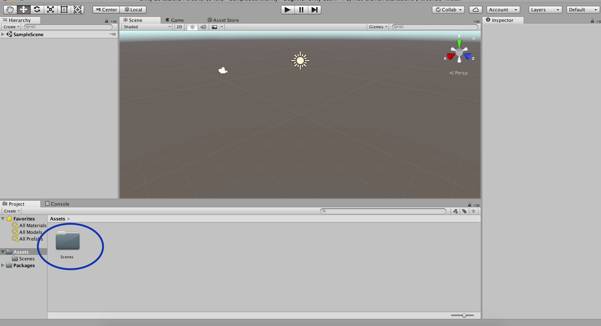

## मंच तैयार करें

इससे पहले कि आप अपना गेम बनाना शुरू कर सकें, आपको थोड़ा सेटअप करने की जरूरत है।

+ यूनिटी शुरू करें और एक नया परियोजना बनाने के लिए **New** चुनें।

+ जब परियोजना के लिए एक नाम पूछा जाये , तो इसे "Beginner Unity Sushi" कहें, ताकि बाद में इसे ढूंढना आसान हो जाए!

+ क्लिक करें **Create Project** और प्रतीक्षा करें अपने परियोजना का स्क्रीन पर!

+ यूनिटी विंडो के ऊपरी दाएं कोने में, आपको **Layout** नामक एक मेन्यू दिखाई देगा। इस पर क्लिक करें और **Default** चुनें|

  

+ **Assets** नाम के पैनल को देखें। आपको वहाँ एक **`Scenes`** नाम का फ़ोल्डर मिलना चाहिए

  

--- collapse ---
---
title: कोई Scenes फ़ोल्डर नहीं है
---

यदि `Scenes`नाम का कोई फ़ोल्डर नहीं है, तो आप इसे बना सकते हैं।

+ मेन्यू बार पर जाएं (Mac पर यह स्क्रीन में सबसे ऊपर होगा, Windows पीसी में ह यह यूनिटी विंडो के ऊपर होगा) और बाईं ओर **Assets** मेनू चुनें।

+ **Create > Folder** चुनें, जिसका अर्थ है कि **Create** विकल्प चुनें और फिर नीचे खुलने वाले मेन्यू में **Folder** विकल्प चुनें।

+ आपसे अपने नए फ़ोल्डर के लिए एक नाम पूछा जाएगा। इसे `Scenes` नाम दे।

--- /collapse ---

अगली चीज़ जो आपको चाहिए वो एक scene है। यह हमारे पास पहले से ही एक है, क्योंकि यूनिटी प्रोजेक्ट उसके साथ शुरू हुआ, इसलिए आपको इसे बस save करने की आवश्यकता है।

+ मुख्य मेनू पर जाएं और **File > Save Scene as...** चुनें| आपको scene को एक नाम देना होगा और इसे सहेजने के लिए एक स्थान चुनना होगा। इसे `MazeRoboBegins` नाम दे और `Scenes` फ़ोल्डर में सहेजें जो `Assets` फ़ोल्डर के अंदर है।

--- collapse ---
---
title: अपने काम को सहेजना
---

+ याद रखें कि आप नियमित रूप से अपने काम को save करें, ताकि आप गलती से अपनी सारी मेहनत न खो दें!

+ सेव करने के लिए, **File > Save Scenes**, क्लिक करें, या <kbd>Ctrl</kbd> (Mac पर <kbd>cmd</kbd>) और <kbd>s</kbd> बटन एक साथ दबाएं।

--- /collapse ---
