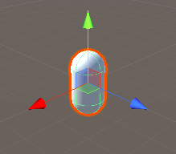
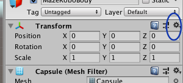
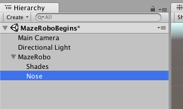
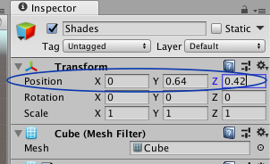

## एक रोबोट बनाओ

अपनी प्रथम ऑब्जेक्ट बनाने का समय!

+ एक **कैप्सूल** ऑब्जेक्ट बनाएं \(**GameObject > 3D Object > Capsule**\): यह आपके रोबोट MazeRobo का शरीर होगा!

  

+ कैप्सूल पर क्लिक करके उसका चयन करें। दाईं ओर आपको काफ़ी विकल्प और मेन्यू दिखेगे। इसे **इंस्पेक्टर**कहा जाता है, और यह वह जगह है जहाँ आप अपने गेम में अधिकांश ऑब्जेक्ट सेट करते हैं।

आप इंस्पेक्टर के शीर्ष पर एक नया नाम लिखकर किसी ऑब्जेक्ट का नाम बदल सकते हैं।

+ कैप्सूल का नाम बदलकर अब `MazeRobo` लिखें।

  

+ अगला, यह सुनिश्चित करने के लिए कि MazeRobo खेल की दुनिया के बीच में है, इंस्पेक्टर के **ट्रांसफ़ॉर्म** अनुभाग में देखें, कॉग आइकन पर क्लिक करें, और **रीसेट**।

  

+ आपको अपना रोबोट बनाने के लिए कुछ और ऑब्जेक्ट की आवश्यकता है, इसलिए **Cube** \(**GameObject > 3D Object > Cube**\) और **Sphere** \(**GameObjects > 3D Object > Sphere**\) बनाएं।

+ क्यूब का नाम `Shades`, और क्षेत्र का नाम `Nose` बदलें।

+ स्क्रीन के बाईं ओर देखें। आपको अपने गेम में ऑब्जेक्ट्स की एक सूची देखनी चाहिए, जिसमें `MazeRobo`, `Shades`और `Nose` होगें। `Shades` पर क्लिक करें और इसे `MazeRobo` पर खींचें। फिर `Nose` को `MazeRobo` पर उसी तरह खींचें।

   
  

--- collapse ---
---
title: ऑब्जेक्ट्स को एक साथ खींचना
---

यह `MazeRobo` ऑब्जेक्ट के अंदर `Shades` और `Nose` ऑब्जेक्ट्स डालता है, इसलिए जब वे चलते हैं, तो वे एक साथ चलते हैं।

अन्य ऑब्जेक्ट को 'अंदर' में रखना आपको जटिल वस्तुओं \(जैसे कि एक गेम कैरेक्टर!\) का निर्माण करने देता है क्यूब्स, क्षेत्रों, कैप्सूल आदि से।

--- /collapse ---

+ अब `Shades` ऑब्जेक्ट चुनें और इंस्पेक्टर के **ट्रांसफ़ॉर्म** सेक्शन को देखें। आपको तीन **समन्वय**  \(X, Y, Z \) का एक सेट दिखाई देगा जो ऑब्जेक्ट की **स्थिति** नियंत्रित करता है।

+ समन्वय के प्रत्येक मान को बदल कर देखने की कोशिश करें कि वे किस दिशा को नियंत्रित करते हैं। कुछ नंबरों के सामने `-` लगाने की कोशिश करें! अंत में, उन्हें इन मानों पर सेट करें:
```
   X = 0
   Y = 0.64
   Z = 0.42
```
  

+ `Nose` लिए भी ऐसा ही करें, उन्हें इस तरह सेट करें:
```
    X = 0
    Y = 0.5
    Z = 0.5
```
यह अभी तक कुछ भी नहीं दिखता है, क्या यह? MazeRobo को रोबोट की तरह दिखने के लिए, आप `Shades` और `Nose` समायोजित करें। आप **स्केल** नियंत्रण के साथ वस्तुओं के आकार को नियंत्रित कर सकते हैं।

+ **इंस्पेक्टर** में रहकर, `Shades` के स्केल नियंत्रणों को देखें। इन मानों को इसके पैमाने निर्धारित करें:
```
    X = 0.64
    Y = 0.16
    Z = 0.16
```
  

+ अब `Nose` स्केल सेट करें:
```
    X = 0.16
    Y = 0.16
    Z = 0.16
```
अब यह रोबोट जैसा दिखने लगा है!

  

अगला कदम में, कुछ रंग जोड़ने का समय है!
