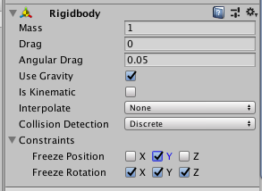

## रंग जोड़ें

+ **Assets > Create > Folder**पर क्लिक करके एक नया फ़ोल्डर बनाएँ, और इसे `Materials`कॉल करें।

+ अब दो **materials** बनाओ (**Assets > Create > Material**) - नाम `EyeBlack` और `NoseRed`।

+ दो नई सामग्री आपके द्वारा अभी बनाई गई `Materials` फ़ोल्डर में होनी चाहिए, स्क्रीन के नीचे **परियोजना** फलक के अंदर। यदि वे वहां नहीं हैं, तो उन्हें `Materials` फ़ोल्डर में खींचें, ताकि वे इसे उसके अंदर आ सकें।

--- collapse ---
---
title: चीजों का नाम बदलना
---

आप राइट-क्लिक करके material या किसी फ़ोल्डर का नाम बदल सकते हैं **नाम बदलें**।

--- /collapse ---

+ आप इंस्पेक्टर में इसके **albedo** मान को बदलकर एक सामग्री का रंग निर्धारित कर सकते हैं। ड्रॉपर आइकन के बगल में आयत पर क्लिक करें, और रंग बीनने वाला मिलना चाहिए।

+ `EyeBlack`के albedo मान को काला करें, और `NoseRed`के albedo को लाल करें।

+ `Shades` ऑब्जेक्ट का चयन करें, इंस्पेक्टर के **Mesh Renderer** अनुभाग को देखें, और **Materials** उपधारा का विस्तार करें। **Element 0** के दाईं ओर छोटे वृत्त पर क्लिक करें और `EyeBlack` चुनें। अब MazeRobo में ब्लैक शेड्स हैं!

+ जैसा कि आपने `Shades` ऑब्जेक्ट के लिए किया था, `Nose` ऑब्जेक्ट के लिए भी करें, बस केवल `NoseRed` material का चयन करें। अब आपने MazeRobo को लाल नाक दिया है!

### अपने रोबोट नियम देना

MazeRobo को एक **Rigidbody** घटक की आवश्यकता है ताकि आप उसे आगे बढ़ा सकें और उसे दुनिया के साथ बातचीत करने दें।

+ MazeRobo चयनित के साथ, **Component > Physics > Rigidbody** पर क्लिक करें। यह आपको नियमों को निर्धारित करने देगा कि कैसे गेम में MazeRobo व्यवहार करता है।

+ अब आप देखेंगे कि जब आपने MazeRobo का चयन किया है, तो इंस्पेक्टर में **Rigidbody** अनुभाग है। खोलें **Constraints** की उपधारा **Rigidbody** अनुभाग, और **Freeze Rotation X, Y and Z** सेट करें **True** सभी बक्से में क्लिक करके। **Freeze Position**, उस बॉक्स पर क्लिक करके **Y** **True** सेट करें।

+ अब आपके पास एक बुनियादी रोबोट चरित्र है जिसे आप अपने खेल में उपयोग कर सकते हैं। आप वास्तव में इसे कुछ रंगों को बदलकर इसे स्वयं अपना बना सकते है, या इसमें अतिरिक्त टुकड़े जोड़कर अधिक **3D Objects** का उपयोग कर सकते हैं, जिससे आप इसे स्थिति में ला सकते हैं, जैसे आपने अंतिम चरण में किया था! एक बार जब आप अपने रोबोट से खुश हो जाएं, तो अगले चरण पर जाएं।
