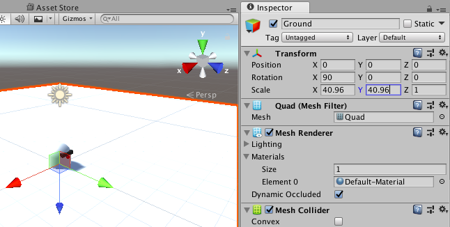
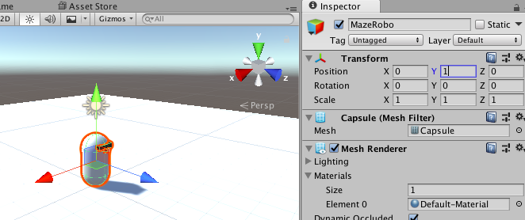

## दुनिया की ज़मीन बनाओ

अब आप MazeRobo के आगे बढ़ने के लिए एक ग्राउंड प्लेन बनाने जा रहे हैं!

+ जमीन होने के लिए **Quad** ऑब्जेक्ट जोड़कर शुरू करें (**GameObject > 3D Object > Quad**)। Inspector में `Quad` से `Ground` इस ऑब्जेक्ट का नाम बदलें।

+ इस नई ऑब्जेक्ट के लिए इंस्पेक्टर में **Transform**, **X Rotation** से `90`सेट करें, और **Scale**, में इन मानों को दर्ज करें:
```
  X = 40.96
  Y = 40.96
  Z = 1
```

  

आह! MazeRobo जमीन में आधा फंस गया! चलो उसे एक मीटर ऊपर ले जाएँ।

+ MazeRobo का चयन करें और, इंस्पेक्टर में **Transform** के तहत, निम्न **Position** समन्वय सेट करें:
```
  X = 0
  Y = 1
  Z = 0
```
  

अब आप अपनी भूलभुलैया शुरू करने के लिए एक दीवार जोड़ देंगे!

+ एक घन बनाएँ (**GameObject > 3D Object > Cube**) और इसके **Transform Position** को सेट करें:
```
  X = -2
  Y = 1.5
  Z = 0 
```
+ Y **Scale** से `3` सेट करें और ऑब्जेक्ट का नाम बदलकर `Wall` करें

+ अब `Wall` के लिए एक नया material बनाएं (**Assets > Create > Materials**), इसे `WallBlue`नाम दे, और इसे (आश्चर्य!) नीला रंग देने के लिए इसके albedo को बदलें।

+ इंस्पेक्टर के **MeshRender > Materials** सेक्शन के उपयोग से `WallBlue` मटीरियल को `Wall` असाइन करें (आप material को ऑब्जेक्ट पर सीधे भी खींच सकते हैं)।

बाद में, आप इस दीवार को MazeRobo के तलाशने के लिए भूलभुलैया में बदल देंगे!


