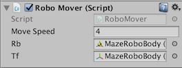

## MazeRobo चलाओ

कुछ कोड लिखने का समय ताकि आपके गेम का खिलाड़ी MazeRobo को नियंत्रित कर सके!

+ परियोजना फलक पर जाएँ और एक नया फ़ोल्डर बनाए \(**Assets &gt; Create &gt; Folder**\) `Assets` फ़ोल्डर के भीतर \(आपको `Assets` फ़ोल्डर पहले क्लिक करना पड़ सकता है\)। नया फ़ोल्डर `Scripts` नाम से बनाए।


+ इस फ़ोल्डर में एक नया C\# script \(**Assets &gt; Create &gt;  C\# Script**\) बनाएं, और इसे `RoboMover` कहें।


+ `RoboMover` पर डबल-क्लिक करें उसे एक संपादक में खोलने के लिए(जो यूनिटी से एक अलग प्रोग्राम है)। आपको कोड कुछ इस तरह दिखाई देना चाहिए:

```cs
using System.Collections;
using System.Collections.Generic;
using UnityEngine;

public class RoboMover : MonoBehaviour {

  // इसे आरंभीकरण के लिए उपयोग करें
  void Start () {

  }

  // Update प्रति फ्रेम एक बार चलाया जाता है
  void Update () {

  }
}
```

--- collapse ---
---
title: कोड को समझना
---
आइए देखें कि आपको यहां क्या मिला है। आप पहली तीन पंक्तियों को अनदेखा कर सकते हैं। वे सिर्फ प्रोग्राम की महत्वपूर्ण चीजों की स्थापना कर रहे हैं। फिर आपको यह मिल गया है:

```cs
public class RoboMover : MonoBehaviour {
```

यह `RoboMover` **class**\(कोड का एक खाका\) की शुरुआत है| `: MonoBehaviour` के बारे में चिंता मत करो अभी। पहले `{` और अंतिम `}` के बीच सब कुछ `RoboMover` class के अंदर है।

फिर, नीचे, आपके पास दो **function declarations** के लिए **functions** नामित `Start` और `Update`। Function declaration वह है जहां एक फ़ंक्शन आपके कोड में परिभाषित होता है। अभी, दोनों फ़ंक्शंस खाली हैं और उनके बीच एकमात्र अंतर उनके नाम हैं, तो चलो बस एक को जल्दी से देखते हैं:

```cs
void Update() {

}
```

एक फ़ंक्शन कंप्यूटर के लिए कुछ करने के लिए निर्देशों का एक सेट है, उस कार्य के लिए एक लेबल के साथ लपेटा जाता है जो याद रखना आसान बनाता है। उदाहरण के लिए, एक मानव के लिए, "मुझे एक कप चाय बनाओ" एक फ़ंक्शन है। हम जानते हैं कि इसके बहुत सारे चरण हैं और अंत में, आपके पास एक कप चाय है। यह मूर्खतापूर्ण होगा कि हर बार जब आप चाय बनाए, कोई व्यक्ति आपको चाय बनाने के लिए हर कदम बताए। कंप्यूटर को कुछ करने के लिए भी यही सच है। इसे एक बार, एक स्थान पर पढ़ाना ज्यादा आसान है, और फिर फंक्शन के लेबल का उपयोग करके बार-बार काम कर सकते है!

इन फ़ंक्शन घोषणाओं में पहला शब्द यहां `void` है। इससे पता चलता है कि फंक्शन से कुछ भी **return** नहीं होगा। इसका मतलब है कि वे Run के अंत में कुछ भी नहीं देते हैं। उदाहरण के लिए, मानव फ़ंक्शन "मुझे एक कप चाय बनाओ" एक कप चाय लौटाता है, जब सभी निर्देश हो जाते हैं, लेकिन "दूध जोड़ें" कुछ भी वापस नहीं करता है, यह सिर्फ पहले से मौजूद चाय के कप को बदल देता है। तो "दूध जोड़ें" एक `void` फ़ंक्शन होगा!

इसके बाद **फंक्शन**का नाम आता है, इस आसान लेबल का उपयोग आप फ़ंक्शन को अपने कोड में कहीं से भी **call** करने के लिए कर सकते हैं। नाम के बगल में गोल कोष्ठक `()` नोटिस करें वे अभी खाली हैं, लेकिन उन्हें फ़ंक्शन में **पास** जानकारी के लिए उपयोग किया जा सकता है। उदाहरण के लिए: "मुझे एक कप चाय बनाओ \(दो शक्कर \)"।

अंत में, आपके पास घुंघराले कोष्ठक `{}` है। उनके अंदर सब कुछ निर्देशों का समूह है जो **फंक्शन** बुलाने पर कार्यक्रम का पालन करेगा। "मेरे लिए एक कप चाय बनाओ" जो कुछ इस तरह होगी:

* पानी उबालें
* चायदानी में पानी डालें
* टीबैग को जोड़ें
* ...और इसी तरह

--- /collapse ---

अब जब आपको काम करने के लिए कुछ कोड मिल गया है, तो इसे जोड़ना शुरू करने का समय आ गया है!

+ सबसे पहले, आपको class के अंदर, लेकिन फंक्शन से पहले, कुछ **वेरिएबल** जोड़ने की आवश्यकता है:

```cs
public class RoboMover : MonoBehaviour {

  public float moveSpeed = 4.0f;
  public Rigidbody rb;
  public Transform tf;

  // इसे आरंभीकरण के लिए उपयोग करें
  void Start () {
```

--- collapse ---
---
title: नया कोड क्या करता है?
---

ये वेरिएबल लेबल हैं मान, या चीजों पर । इस मामले में हमें मिला है:

   * `moveSpeed` - एक फ्लोट \(decimal\) संख्या, इस मामले में `4.0`
   * `rb` - एक वेरिएबल जिसका उपयोग आप **Rigidbody** घटक \(जो कि खुद MazeRobo है, याद है?\) के लिए करेंगे।
   * `tf` - एक वेरिएबल जिसका उपयोग आप **Transform** घटक को संदर्भित करने के लिए करेंगे

--- /collapse ---

+ आपको वास्तव में इस कार्यक्रम में `Start` फ़ंक्शन की आवश्यकता नहीं है, इसलिए आप इन पंक्तियों को हटा सकते हैं:

```cs
// इसे आरंभीकरण के लिए उपयोग करें
void Start () {

}
```

+ अब आपको इस कोड के साथ `Update` फ़ंक्शन को भरना होगा:

```cs
// Update प्रति फ्रेम एक बार चलाया जाता है
void Update () {
  Vector3 desiredDirection = new Vector3 (Input.GetAxis ("Horizontal"), 0.0f, Input.GetAxis ("Vertical"));
  desiredDirection = moveSpeed * desiredDirection;
  desiredDirection = Time.deltaTime * desiredDirection;
  rb.MovePosition (rb.position + desiredDirection);
}
```

--- collapse ---
---
title: नया कोड क्या करता है?
---

फ़ंक्शन की पहली पंक्ति `desiredDirection`, जो तीन समन्वय का एक सेट है। उनमें से दो को `Input`से लिया गया है, जो कि खेल को खिलाड़ी से मिलने वाली दिशा है। अंतिम चरित्र की गहराई है, जिसे आप नहीं बदल रहे हैं, इसलिए यह `0.0` सेट है।

इसके बाद आप `desiredDirection` में `moveSpeed` गुणा करते हैं, जिस वेरिएबल को आपने पहले सेट किया था जो कि MazeRobo की गति को नियंत्रित करता है।

इसके बाद, आप `desiredDirection` फिर से `Time.deltaTime` से गुणा करते हैं, जो कि पिछली बार `Update` चलने के बाद की राशि है। इसका मतलब यह है कि दिशा सही ढंग से बदलती है चाहे आपका गेम कोई भी प्रकार के कंप्यूटर पर Run हो।

अंत में, आप **Rigidbody** `rb` की स्थिति को बदलते हैं (यह MazeRobo है) उस राशि से जो आपने गणना की है और `desiredDirection` में संग्रहीत है।

हर बार स्क्रीन अपडेट होने के बाद, character उस दिशा में एक छोटा सा कदम रखता है जिसे खिलाड़ी नियंत्रण के साथ भेज रहा है।

--- /collapse ---

+ अपने कोड को save करें (**File > Save**)।

इससे हो जाना चाहिए! आप अब MazeRobo चलाने के करीब हैं!

+ यूनिटी में वापस, `Scripts` फ़ोल्डर से अपने `RoboMover` स्क्रिप्ट को खींचें और ड्रॉप करें और **Hierarchy** में `MazeRobo` **GameObject** पर रखें।


+ आप देखेंगे कि स्क्रिप्ट के लिए एक क्षेत्र अब दिखाई देता है, MazeRobo के इंस्पेक्टर में **Rigidbody** के नीचे।


+ `RoboMover` में दो खाली फ़ील्ड हैं: `rb` और `tf`| जैसा कि आप जानते हैं, ये सभी **Rigidbody** और **Transform**लिए होते हैं, और यदि आप इन घटकों के नामों को इंस्पेक्टर के स्थानों से और उनके संबंधित क्षेत्रों में खिसका तो, `RoboMover` \(स्क्रिप्ट\) में सभी जानकारी होगी जो MazeRobo स्थानांतरित करने में प्रयोग होगी!

 

+ अब यूनिटी इंटरफेस के शीर्ष केंद्र पर बड़े **Play** बटन पर क्लिक करें...

MazeRobo चलता है!

+ MazeRobo को नियंत्रित करने के लिए तीर कुंजियों का उपयोग करें। जब आप काम पूरा कर लें, तो गेम को रोकने के लिए फिर से **Play** बटन दबाएं।
