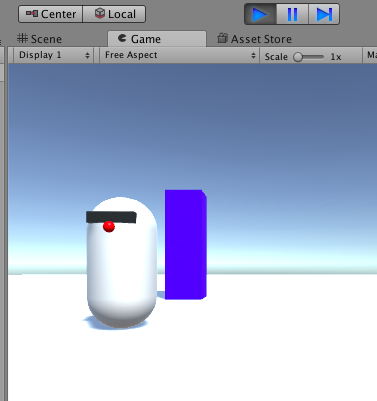

## ठीक से चलना

MazeRobo चलता है, लेकिन यह थोड़ा... अजीब है। यह देखने के लिए इधर-उधर नहीं घूमता कि यह कहाँ जा रहा है। आप इसे ठीक कर सकते हैं!

+ `RoboMover` स्क्रिप्ट में वापस जाएं और इस नई पंक्ति को `rb.MovePosition` के नीचे जोड़ें।

```cs
rb.MoveRotation (Quaternion.LookRotation (desiredDirection, Vector3.up));
```

इस लाइन से MazeRobo को दिखता है कि वह कहाँ जा रहा है।

+ खेल Run करो और इसे देखें!

MazeRobo देखता है कि वह कहाँ जा रहा है, लेकिन जैसे ही आप नियंत्रण छोड़ते हैं यह अपनी मूल दिशा में वापस देखने लगता है। आप उसे भी ठीक कर सकते हैं!

--- collapse ---
---
title: क्यों रोबोट दूसरी तरफ वापस जाता है?
---

समस्या यह है कि यूनिटी MazeRobo की मूल दिशा को डिफ़ॉल्ट मान `0`रूप में समझती है, और इसलिए जब खिलाड़ी से कोई सक्रिय इनपुट नहीं होता है, तो इनपुट `0` है, तो यह वह जगह है जहाँ रोबोट देखता हैं।

आपको इसे बनाने की आवश्यकता है ताकि MazeRobo केवल सक्रिय खिलाड़ी के इनपुट के आधार पर चले।

कोड में इसके लिए आप जिस चेक का उपयोग करेंगे, वह है: **if** खिलाड़ी का इनपुट बहुत छोटी संख्या से बड़ा है \(`0.01`\), **then** चले और मुड़ो। तो उस डिफ़ॉल्ट `0` लिए कुछ भी नहीं होगा।

--- /collapse ---

+ पहली चीज जो आपको करने की आवश्यकता है वह है कि आपके सभी मौजूदा दिशा परिवर्तन कोड को `if` कथन में लपेट दिया जाए, जो कि केवल इसके अंदर कोड चलाता है यदि कोष्ठक में स्थिति `true` है।

```cs
// Update प्रति फ्रेम एक बार चलाया जाता है
void Update () {

    if (true) {
      Vector3 desiredDirection = new Vector3 (Input.GetAxis ("Horizontal"), 0.0f, Input.GetAxis ("Vertical"));
      desiredDirection = moveSpeed * desiredDirection;
      desiredDirection = Time.deltaTime * desiredDirection;
      rb.MovePosition (rb.position + desiredDirection);
      rb.MoveRotation (Quaternion.LookRotation (desiredDirection, Vector3.up));
    }
}
```

--- collapse ---
---
title: नया कोड क्या करता है?
---

अभी, आप मजबूर कर रहे हैं `if` यदि कथन **true** है तो वास्तव में इसे `true` करके शर्त के रूप में। इसका मतलब है कि यह कोड ठीक वैसे ही चलेगा जैसे पहले था। आप इसे एक पल में बदल देंगे।

--- /collapse ---

+ खेल को चलाएं और जांचें कि यह सब अभी भी काम कर रहा है।

अब आपको अपनी परीक्षा की स्थिति बनाने की आवश्यकता है।

+ `if` स्टेटमेंट से ऊपर लेकिन `Update` फ़ंक्शन के अंदर अभी भी, आपको प्लेयर इनपुट एकत्र करने और उनके **absolute** मान प्राप्त करने की आवश्यकता होगी जैसे:

```cs
    void Update () {

    float inputHorizontal = Mathf.Abs (Input.GetAxis ("Horizontal"));
    float inputVertical = Mathf.Abs (Input.GetAxis ("Vertical"));

    if (true) {
```

--- collapse ---
---
title: निरपेक्ष मूल्य क्या है, और यह क्या करता है?
---

जब आप MazeRobo को आगे जाने के लिए कहते हैं, तो यूनिटी इसे एक सकारात्मक संख्या के रूप में देखती है \(जैसे `1`\), और जब आप इसे पीछे की ओर जाने के लिए कहते हैं, तो यूनिटी इसे एक नकारात्मक संख्या के रूप में देखती है \(जैसे `-1`\)।

आप केवल संख्या के **size** के लिए परीक्षण करना चाहते हैं, इसके संकेत पर ध्यान दिए बिना, जिसके कारण आप संख्या के निरपेक्ष मान का उपयोग कर रहे हैं।

**निरपेक्ष मान** संकेत के बिना संख्या का मूल्य है, इसलिए यह हमेशा एक सकारात्मक संख्या या शून्य है।

--- /collapse ---

अब `if` अपडेट करने के लिए समय आ गया है जिससे यह वास्तव में कुछ परीक्षण करे! `if` के उपरांत जो कोष्ठक में है उसे बदलने की आवश्यकता होगी जिससे कि यह जांच करे कि `inputHorizontal` **greater than**  `0.01` **or** अगर `inputVertical` **greater than**  `0.01` है, और परिणाम `true` देता है कोई भी मामले में।

ऐसा करने के लिए, आपको अपनी शर्तों के बीच एक 'or' का उपयोग करने की आवश्यकता होगी जिसे आपका कंप्यूटर समझ सकता है। C\#\(जिस भाषा में आप अपनी यूनिटी स्क्रिप्ट लिख रहे हैं) में हम दो पाइप वर्णों के साथ 'or' का प्रतिनिधित्व करते हैं, जैसे: `condition A || condition B`. दो या दो से अधिक स्थितियों में शामिल होने के अन्य तरीके भी हैं, उदाहरण के लिए 'and' ऑपरेटर \(`&&`\), और आप उन्हें ऑनलाइन देख सकते हैं यदि आपको उनकी आवश्यकता है।

+ अपनी आवश्यकता के अनुसार 'or' स्थिति लिखने के लिए, अपने `if` कथन को इस प्रकार अपडेट करें:

```cs
  if (inputHorizontal > 0.01f || inputVertical > 0.01f) {
```

अब MazeRobo को उस दिशा का सामना करना चाहिए, जिसमें वह चलता है! यदि आपको कोई समस्या हो रही है, तो जांचें कि आपका `Update` फ़ंक्शन इस कोड से मेल खाता है:

```cs
void Update () {

  float inputHorizontal = Mathf.Abs (Input.GetAxis ("Horizontal"));
  float inputVertical = Mathf.Abs (Input.GetAxis ("Vertical"));

  if (inputHorizontal > 0.01f || inputVertical > 0.01f) {
    Vector3 desiredDirection = new Vector3 (Input.GetAxis ("Horizontal"), 0.0f, Input.GetAxis ("Vertical"));
    desiredDirection = moveSpeed * desiredDirection;
    desiredDirection = Time.deltaTime * desiredDirection;
    rb.MovePosition (rb.position + desiredDirection);
    rb.MoveRotation (Quaternion.LookRotation (desiredDirection, Vector3.up));
    }
```


