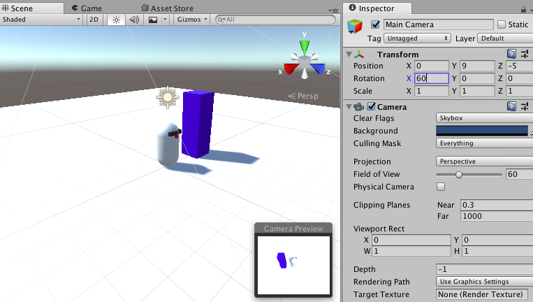
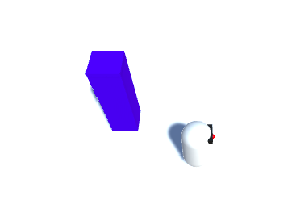

## कैमरा ट्रैकिंग

MazeRobo चलता है, लेकिन अभी कैमरा हमेशा एक ही स्थान पर रहता है। यह एक समस्या होने जा रही है अगर आप कैमरे की दृष्टि के प्रारंभिक क्षेत्र के बाहर कुछ भी जोड़ने की कोशिश करते हैं, या कुछ भी जो इसके बाहर चलता है (जैसे कि खुद MazeRobo!)। चलो इसे समायोजित करें!

+ पदानुक्रम में **Main Camera** का चयन करें और निरीक्षक में इसके **Transform** गुण सेट करें:

  


  ### पोजीशन
  ```
  X: 0
  Y: 9
  Z: -5
  ```

  ### रोटेशन
  ```
  X: 60
  Y: 0
  Z: 0
  ```

  ### पैमाना
  ```
  X: 1
  Y: 1
  Z: 1
  ```


अब आपने कैमरे के कोण को बदल दिया है (यदि आपको पसंद है तो इसे चलाने के लिए गेम को चलाएं!), लेकिन यह अभी भी MazeRobo का पीछा नहीं करता है।

ऐसा करने के लिए, आपको हर फ्रेम में कैमरे के स्थान को अपडेट करना होगा, और इसके लिए आपको एक और स्क्रिप्ट की आवश्यकता होगी!

+ एक नई स्क्रिप्ट बनाएं (**Assets > Create > C# Script**) और इसे `CameraMover` कहें। इसे `Scripts` फ़ोल्डर में रखें।

+ स्क्रिप्ट की शुरुआत में, `CameraMover` **class** के अंदर तीन **variables** जोड़ें:

```cs
  public class CameraMover : MonoBehaviour {

    public Transform tf;
    public Transform playerTransform;
    public Vector3 distanceBetweenPlayerAndCam;      
```

--- collapse ---
---
title: नया कोड क्या करता है?
---

कोड ट्रैक की ये लाइनें:
+ कैमरे की स्थिति (`tf`)
+ MazeRobo की स्थिति (`playerTransform`)
+ दूरी, (X, Y, Z), MazeRobo से कैमरा तक (`distanceBetweenPlayerAndCam`)

--- /collapse ---

+ अब आपको MazeRobo और कैमरे के बीच की शुरुआती दूरी तय करनी होगी, जैसा कि आप रखना चाहते हैं। `Start` फ़ंक्शन के अंदर ऐसा करें:

```cs
  void Start () {
    distanceBetweenPlayerAndCam = tf.position - playerTransform.position;
  } 
```

+ इसके बाद, यह सुनिश्चित करें कि खेल हर फ्रेम में समान दूरी बनाए रखें ऐसा करने के लिए `Update` में पंक्ति इस प्रकार जोड़ते हैं

```cs
  void Update () {
    tf.position = playerTransform.position + distanceBetweenPlayerAndCam;
  }
```

+ अब आपको स्क्रिप्ट को कैमरे से जोड़ना होगा, इसलिए यूनिटी पर वापस जाएं और पदानुक्रम में मुख्य कैमरा चुनें। फिर मुख्य कैमरा पर प्रोजेक्ट स्पेस से `CameraMover` स्क्रिप्ट खींचें।

+ इंस्पेक्टर में **CameraMover** फ़ील्ड ढूंढें, और मुख्य कैमरा को Hierarchy से **Tf** फ़ील्ड में खींचें। फिर **Player Transform** फ़ील्ड में MazeRobo को हायरार्की से खिसकाना।


+ अब इस खेल को चलाएं और चारों ओर से MazeRobo को कैमरे का पालन करते देखे!


