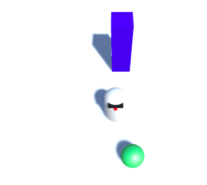

## MazeRobo को साथ खेलने के लिए कुछ दे

अब जब आपको अपना चरित्र मिल गया है और यह ठीक से घूम रहा है, तो इसे खेलने के लिए कुछ देने का समय है! आप MazeRobo के चारों ओर धकेलने के लिए एक गेंद जोड़ने जा रहे हैं।

+ शुरू करें **Sphere** (**GameObject > 3D Object > Sphere**) बनाकर। इसका नाम बदलें `Ball`।

+ `Ball` की **Transform Position** गुण सेट करें:
```
  X: 0
  Y: 1
  Z: 2
```
+ एक और material बनाएं ( **Add colour** चरण देखें यदि आपको याद नहीं है!) और इसे हरा करें। इसे `BallGreen` कॉल करें और `Ball` पर खींचें!


यदि आप अभी गेम का परीक्षण करते हैं और MazeRobo को गोले में चलाते हैं, तो आप देखेंगे कि यह दीवार की तरह ही व्यवहार करता है: यह चलता नहीं है। आप चाहते हैं कि गोला एक रोलिंग बॉल हो, लेकिन आपको इसे स्थानांतरित करने के लिए कुछ नियम देने होंगे, जैसे कि MazeRobo के पास है।

+ `Ball` चयन करें और इसे **Rigidbody** घटक (**Component > Physics > Rigidbody**) दें।

+ अब खेलने की कोशिश करो!


