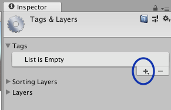
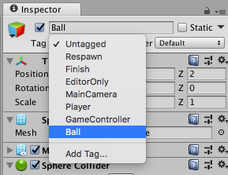
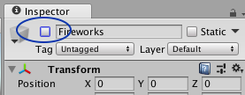
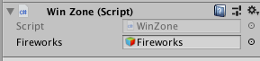
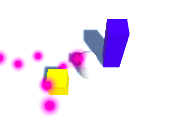

## Winning!

You've got a robot, you've got a ball... now in order for it to be a game, there's got to be a way to win! You'll be adding that now.

+ First, add another cube and call it `WinZone`. Maybe give it a new, noticeable colour (yellow? orange? pink?).

+ Make sure you have `WinZone` selected in the Hierarchy, and in the Inspector under **Box Collider**, select the **Is Trigger** option.


+ Set the **Transform Position** property of `WinZone` so that it is:
  ```
  X: -5
  Y: 1
  Z: -2
  ```
You're going to write another script to let `WinZone` detect when the `Ball` touches it. In order to do that, the ball needs to be **tagged**.

+ Select `Ball` in the Hierarchy, and in the **Inspector** select the **Tag** field just under its name.


+ Choose **Add Tag...**, then click on the **+** icon and create the tag 'Ball'.

 

+ Re-select `Ball` in the Hierarchy, select the **Tag** field again, and choose the 'Ball' tag you just created.



While you're at it, why not add some celebration to let the player know when they've won!

+ Create a **Particle System** (**GameObject > Effects > Particle System**) and call it `Fireworks`.

+ Select the `Fireworks` object and unselect the box beside its name in the Inspector. This hides the object, so you can make it appear once you're ready to set off the fireworks!



+ Now look in the list of settings in the Inspector, find **Start Color** and set it to yellow, or green, or whatever you like really!

+ Finally, make the **Position** of the `Fireworks` match the **Position** of `WinZone`.

Now you'll add code to make the fireworks appear when it's the right time!

+ Create a C# script (in the `Scripts` folder) called `WinZone`. Open the new script and remove the `Start` and `Update` functions. Put this code inside it instead:

```cs
public GameObject fireworks;

void OnTriggerEnter (Collider col) {
  if (col.transform.CompareTag ("Ball")) {
    fireworks.SetActive (true);
  }
}
```

--- collapse ---
---
title: What does the new code do?
---

What's happening here is that a GameObject called `fireworks` is created (you'll connect it to your `Fireworks` in a moment), and the script then waits for any **Rigidbody** to touch the **Collider** object it's attached to (whichever one you drag the script onto — in this case it'll be `WinZone`).

The **Rigidbody** that collided with it will automatically be assigned to the **Collider** variable `col`. If that **Rigidbody** happens to have the tag 'Ball', then the `fireworks` object will be made to appear.

--- /collapse ---

+ Save the changes to the script and go back into Unity.

+ Drag the script onto the `WinZone` in the Hierarchy and then, with `WinZone` selected, drag the `Fireworks` object from the Hierarchy into the **Fireworks** field in the **WinZone** section of the Inspector.




+ Save the game, run it, and put the `Ball` in the `WinZone`. See what happens!



That's all the basic pieces of the game!

--- challenge ---

## Challenge: make a maze for the robot

Now, your robot is called 'MazeRobo', so there should probably be a maze!

+ You've got one wall, so add some more cubes, play with their **Position** and **Scale** to build a few walls!

+ Give your player a real challenge: move the `WinZone` around a little, so it's harder to get to!

+ If you know someone else who is making this game, try doing a swap to see if you can beat each other's mazes!

--- /challenge ---
