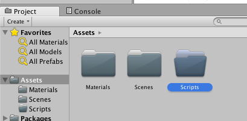
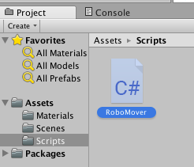
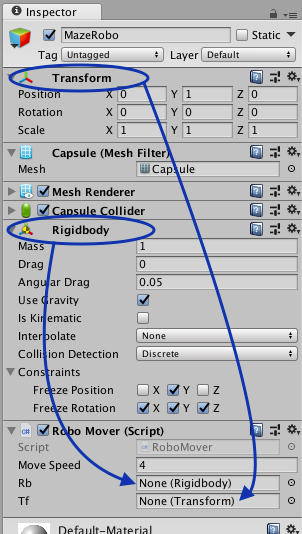

## Laat MazeRobo bewegen

Tijd om wat code te schrijven zodat de speler van je spel MazeRobo kan besturen!

+ Ga naar het projectpaneel en maak een nieuwe map \(**Assets &gt; Create &gt; Folder**\) binnen de `Assets` map \(mogelijk moet je eerst op de `Assets` map klikken\). Noem de nieuwe map `Scripts`.



+ Maak een nieuw C\# script \(**Assets &gt; Create &gt; C# Script**\) in deze map en noem het `RoboMover`.



+ Dubbelklik op `RoboMover` om het te openen in een editor (wat een apart programma is van Unity). Het zou er zo moeten uitzien:

```cs
using System.Collections;
using System.Collections.Generic;
using UnityEngine;

public class RoboMover : MonoBehaviour {

  // Use this for initialization
  void Start () {

  }

  // Update is called once per frame
  void Update () {

  }
}
```

--- collapse ---
---
title: De code begrijpen
---
Laten we eens kijken wat je hier hebt. Je kunt de eerste drie regels negeren. Ze zijn slechts dingen die het programma instelt die het nodig heeft. Dan heb je dit:

```cs
public class RoboMover : MonoBehaviour {
```

Dit is het begin van een **class** \(een blauwdruk van code\) genaamd `RoboMover`. Maak je geen zorgen over de `: MonoBehaviour`. Alles tussen deze eerste `{` en de laatste `}` zit in de `RoboMover` class.

Daarna heb je twee **declaraties van functies** voor de **functies** genaamd `Start` en `Update`. Een functie declaratie is waar een functie wordt gedefinieerd in je code. Op dit moment zijn de functies leeg en het enige verschil is de naam, dus laten we er snel een bekijken:

```cs
void Update() {

}
```

Een functie is een set instructies voor een computer om iets te doen, verpakt met een label voor de taak die het gemakkelijk te onthouden maakt. Voor een mens is bijvoorbeeld 'Maak een kopje thee voor mij' een functie. We weten dat er veel stappen voor nodig zijn en aan het einde heb je een kopje thee. Het zou dwaas zijn om elke keer dat je wilde dat iemand thee voor je maakte elke stap aan die persoon te vertellen. Hetzelfde geldt voor de computer vragen om iets te doen. Veel gemakkelijker is het om het één keer te leren, op één plek, en het dan steeds opnieuw te laten doen door gewoon het label van de functie te gebruiken!

Het eerste woord in deze functie declaraties hier is `void` (leeg). Dat laat zien dat de functies niets **teruggeven (return)**. Dat betekent dat ze aan het einde van het uitvoeren niets teruggeven. De menselijke functie 'Maak een kopje thee voor mij' levert bijvoorbeeld een kopje thee op als alle instructies zijn voltooid, maar "Melk toevoegen" geeft niets terug, het verandert alleen de reeds bestaande kop thee. Dus "Melk toevoegen" zou een `void` functie zijn!

Vervolgens komt de naam van de **functie**, dat gemakkelijke label dat je kunt gebruiken om deze **aan te roepen (call)** van ergens anders in je code om deze te gebruiken. Let op de ronde haakjes `()` naast de naam. Ze zijn nu leeg, maar ze kunnen worden gebruikt om informatie **door te geven** naar de functie. Bijvoorbeeld: "Maak een kopje thee \(twee suikerklontjes\)".

Op het eind heb je de accolades `{}`. Alles wat er binnen staat is de set aan instructies die het programma zal volgen wanneer de **functie** wordt aangeroepen. Voor "Maak een kopje thee voor mij" zou dat zijn:

* Water koken
* Doe water in theepot
* Voeg theezakje toe
* ...enzovoort

--- /collapse ---

Nu je wat code hebt om mee te werken, is het tijd om iets eraan toe te voegen!

+ Eerst moet je enkele **variabelen** toevoegen, binnen de class maar vóór de functies, zoals dit:

```cs
public class RoboMover : MonoBehaviour {

  public float moveSpeed = 4.0f;
  public Rigidbody rb;
  public Transform tf;

  // Use this for initialization
  void Start () {
```

--- collapse ---
---
title: Wat doet de nieuwe code?
---

Deze variabelen zijn labels op waarden of dingen. In dit geval hebben we:

   * `moveSpeed` — een float \(decimaal\) getal (drijvende komma getal), in dit geval `4.0`
   * `rb` — een variabele die je gebruikt om naar de **Rigidbody** component te verwijzen \(en dat is MazeRobo zelf, weet je nog?\)
   * `tf` — een variabele die je gebruikt om te verwijzen naar de **Transform** component

--- /collapse ---

+ Je hebt de `Start` functie niet echt nodig in dit programma, dus je kunt deze regels verwijderen:

```cs
// Use this for initialization
void Start () {

}
```

+ Nu moet je de `Update` functie vullen met deze code:

```cs
// Update is called once per frame
void Update () {
  Vector3 desiredDirection = new Vector3 (Input.GetAxis ("Horizontal"), 0.0f, Input.GetAxis ("Vertical"));
  desiredDirection = moveSpeed * desiredDirection;
  desiredDirection = Time.deltaTime * desiredDirection;
  rb.MovePosition (rb.position + desiredDirection);
}
```

--- collapse ---
---
title: Wat doet de nieuwe code?
---

De eerste regel van de functie creëert `desiredDirection`, dat is een set van drie coördinaten die de gewenste richting bepaald. Twee ervan zijn afkomstig van `Input`, wat de richting is die het spel van de speler ontvangt. De laatste is de diepte van het personage, die je niet verandert, dus het is ingesteld op `0.0`.

Vervolgens vermenigvuldig je de `desiredDirection` met `moveSpeed`, de variabele die je eerder hebt ingesteld en die de snelheid regelt waarmee MazeRobo beweegt.

Vervolgens vermenigvuldig je `desiredDirection` opnieuw met`Time.deltaTime`, dit is de hoeveelheid tijd die verlopen is sinds de laatste keer dat `Update` uitgevoerd werd. Dit betekent dat de richting correct verandert, ongeacht het type computer waarop je game draait.

Ten slotte verander je de positie van de **Rigidbody** `rb` (dat is MazeRobo) met het getal dat je hebt berekend en opgeslagen in `desiredDirection`.

Dit alles komt erop neer dat, telkens wanneer het scherm wordt bijgewerkt, het personage een klein beetje beweegt in de richting waarin de speler het stuurt met de bedieningselementen.

--- /collapse ---

+ Zorg ervoor dat je je code opslaat (**File > Save**).

Dat zou het moeten zijn! Je bent nu bijna klaar om MazeRobo in beweging te krijgen!

+ Terug in Unity, sleep je `RoboMover` script uit de `Scripts` map naar het `MazeRobo` **GameObject** in de **Hierarchy**.


+ Je zult zien dat een veld voor het script nu zichtbaar is in MazeRobo's Inspector, onder **Rigidbody**.


+ Er zijn twee lege velden in de `RoboMover` sectie: `rb` en `tf`. Zoals je weet, staan deze voor **Rigidbody** en **Transform**, en als je de namen van deze componenten klikt en sleept van hun plaatsen in de Inspector naar hun respectievelijke velden, dan heeft `RoboMover` \(het script\) alle informatie die nodig is om MazeRobo te verplaatsen!

 

+ Klik nu op de grote **Play** knop bovenaan in het midden van de Unity-interface...

MazeRobo beweegt!

+ Gebruik de pijltjestoetsen om MazeRobo te besturen. Als je klaar bent, druk je opnieuw op de knop **Play** om het spel te stoppen.
