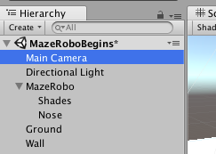
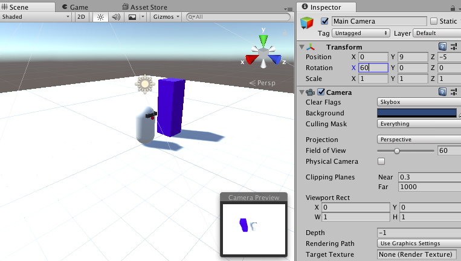

## Automatisch volgen van de camera

MazeRobo beweegt, maar op dit moment blijft de camera altijd op dezelfde plek. Dat wordt een probleem als je iets buiten het oorspronkelijke gezichtsveld van de camera probeert toe te voegen, of iets dat daarbuiten beweegt (zoals MazeRobo zelf!). Laten we het aanpassen!

+ Selecteer de **Main Camera** in de Hierarchy en stel de **Transform** eigenschappen in de Inspector als volgt in:

  


  ### Position
  ```
  X: 0
  Y: 9
  Z: -5
  ```

  ### Rotation
  ```
  X: 60
  Y: 0
  Z: 0
  ```

  ### Scale
  ```
  X: 1
  Y: 1
  Z: 1
  ```


Nu heb je de camerahoek gewijzigd (voer het spel uit om het te testen als je wilt!). Maar het volgt MazeRobo nog steeds niet.

Om dat mogelijk te maken, moet je de locatie van de camera elk frame bijwerken en daarvoor heb je een ander script nodig!

+ Maak een nieuw C\# script \(**Assets > Create > C\# Script**\) en noem het `CameraMover`. Zet het in de `Scripts` map.

+ Aan het begin van het script, net binnen de `CameraMover` **class**, voeg drie **variabelen** toe zoals dit:

```cs
  public class CameraMover : MonoBehaviour {

    public Transform tf;
    public Transform playerTransform;
    public Vector3 distanceBetweenPlayerAndCam;      
```

--- collapse ---
---
title: Wat doet de nieuwe code?
---

Deze regels code volgen:
+ De positie van de camera (`tf`)
+ De positie van MazeRobo (`playerTransform`)
+ De afstand, in (X, Y, Z), van MazeRobo tot de camera (`distanceBetweenPlayerAndCam`)

--- /collapse ---

+ Nu moet je de initiële afstand tussen MazeRobo en de camera instellen als degene die je wilt behouden. Doe dit binnen de `Start` functie zo:

```cs
  void Start () {
    distanceBetweenPlayerAndCam = tf.position - playerTransform.position;
  } 
```

+ Zorg er vervolgens voor dat de game die afstand in elk frame van de game hetzelfde houdt door een regel toe te voegen aan de `Update` functie als volgt:

```cs
  void Update () {
    tf.position = playerTransform.position + distanceBetweenPlayerAndCam;
  }
```

+ Je moet het script nu aan de camera koppelen, dus ga terug naar Unity en selecteer de Main Camera in de Hierarchy. Sleep vervolgens het `CameraMover` script vanuit de projectruimte op de hoofdcamera.

+ Zoek de **CameraMover** sectie in de Inspector en sleep de Main Camera van de hiërarchie naar het **Tf** veld. Sleep vervolgens MazeRobo van de Hierarchy naar het **Player Transform** veld.


+ Start nu het spel en kijk hoe de camera MazeRobo volgt!


