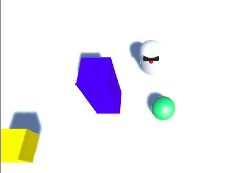

## Inleiding

In dit project maak je je eerste game met Unity, een professioneel gameontwikkelingsplatform.

### Wat ga je maken

Je gaat een eenvoudig videospel bouwen met een robot, een bal en een doolhof, en je leert de tools die je kunt gebruiken om het spel groter en indrukwekkender te maken!

--- collapse ---
---
title: Wat ga je leren
---

+ Hoe maak je een 3D-object
+ Hoe de kleur, vorm en positie van objecten te veranderen
+ Hoe de camerahoek aan te passen om een speler in het spel te volgen
+ Hoe je een script aan een object kunt toevoegen en code kunt schrijven om beweging en gedrag te beïnvloeden

--- /collapse ---

--- collapse ---
---
title: Wat heb je nodig
---

### Hardware

+ Een computer (Windows of macOS) waarop Unity kan worden uitgevoerd

### Software

+ Je moet Unity installeren en instellen op jouw computer. Dit kan even duren, omdat het een groot softwarepakket is.

--- /collapse ---

--- collapse ---
---
title: Hoe Unity te verkrijgen
---

+ Ga naar [dojo.soy/getunity](http://dojo.soy/getunity) en klik op de **Download Unity Hub** knop.
+ Voer het installatieprogramma uit nadat het is gedownload en volg de instructies op het scherm en accepteer alle standaardopties.
+ Wacht tot de download- en installatiestappen zijn voltooid.
+ Zodra de Unity-software is geïnstalleerd, moet je een account maken (of inloggen als je er al een hebt). Dit is zodat je toegang hebt tot de gratis versie, die enkel voor persoonlijk gebruik is.

--- /collapse ---

### Aanvullende informatie voor docenten

Als je dit project wilt afdrukken, gebruik dan de [printervriendelijke versie](https://projects.raspberrypi.org/nl-NL/projects/project-name/print){:target="_blank"}.

Gebruik de link in de voettekst voor toegang tot de GitHub repository voor dit project, met daarin alle bronnen (inclusief een voorbeeld van een voltooid project) in de map 'nl/resources'.