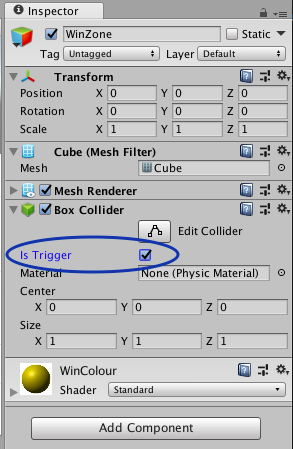
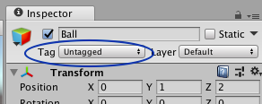
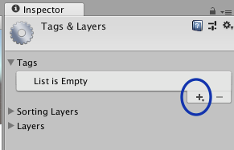
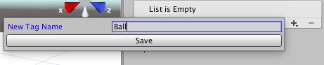
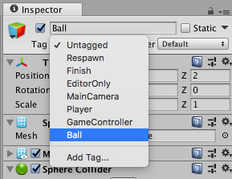
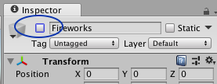
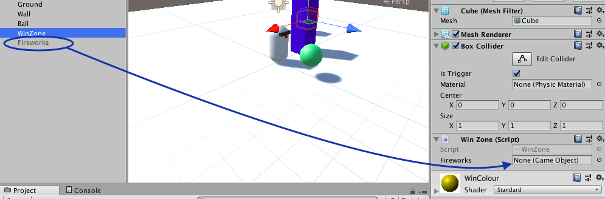
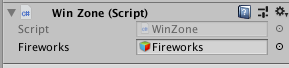
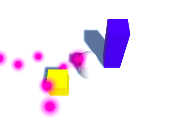

## Winnen!

Je hebt een robot, je hebt een bal... om het een echt spel te laten zijn, moet er een manier zijn om te winnen! Dat ga je nu toevoegen.

+ Voeg eerst nog een cube (kubus) toe en noem deze `WinZone`. Geef het misschien een nieuwe, opvallende kleur (geel? oranje? roze?).

+ Zorg ervoor dat je `WinZone` geselecteerd hebt in de Hierarchy en in de Inspector onder **Box Collider** selecteer je de **Is Trigger** optie.



+ Stel de **Transform Position** eigenschap van `WinZone` in zodat deze is:
  ```
  X: -5
Y: 1
Z: -2
  ```
Je gaat nog een script schrijven om `WinZone` te laten detecteren wanneer de `Ball` aangeraakt wordt. Om dat te doen, moet de bal **getagd (gelabeld)** zijn.

+ Selecteer `Ball` in de Hierarchy en in de **Inspector**, selecteer het **tag**-veld net onder zijn naam.



+ Kies **Add Tag...** en klik vervolgens op het **+** pictogram en maak de tag 'Ball'.

 

+ Selecteer `Ball` opnieuw, selecteer in de Inspector het **Tag**-veld opnieuw en kies de 'Ball'-tag die je zojuist hebt gemaakt.



Terwijl je toch bezig bent, kun je een feestje toevoegen om de speler te laten weten wanneer hij gewonnen heeft!

+ Maak een **Particle System** (**GameObject > Effects > Particle System**) en noem het `Fireworks (vuurwerk)`.

+ Selecteer het `Fireworks` object en deselecteer het vak naast de naam in de Inspector. Dit verbergt het object, zodat je het kunt laten verschijnen zodra je klaar bent om het vuurwerk af te steken!



+ Kijk nu in de lijst met instellingen in de Inspector, zoek **Start Color** en zet het op geel, of groen, of wat je maar wilt!

+ Maak ten slotte de **Position** van `Fireworks` gelijk aan de **Position** van `WinZone`.

Nu voeg je de code toe om het vuurwerk op het juiste moment te laten verschijnen!

+ Maak een C#-script (in de `Scripts` map) genaamd `WinZone`. Open het nieuwe script en verwijder de `Start` en `Update` functies. Zet in plaats daarvan deze code erin:

```cs
public GameObject fireworks;

void OnTriggerEnter (Collider col) {
  if (col.transform.CompareTag ("Ball")) {
    fireworks.SetActive (true);
  }
}
```

--- collapse ---
---
title: Wat doet de nieuwe code?
---

Wat hier gebeurt, is dat een GameObject genaamd `fireworks` is gemaakt (je koppelt het zo dadelijk aan je `Fireworks`), en het script wacht dan tot een **RigidBody** het **Collider**-object aanraakt, waaraan het is gekoppeld (naar welke je het script ook sleept — in dit geval is het `WinZone`).

De **Rigidbody** die ermee in botsing kwam, wordt automatisch toegewezen aan de **Collider** variabele `col`. Als die **Rigidbody** toevallig de tag 'Ball' heeft, dan zal het `fireworks` object verschijnen.

--- /collapse ---

+ Sla de wijzigingen in het script op en ga terug naar Unity.

+ Sleep het script naar de `WinZone` in de Hierarchy en dan met `WinZone` geselecteerd, sleep het `Fireworks` object van de Hierarchy in het **fireworks** veld in de **WinZone** sectie van de inspector.





+ Sla het spel op, voer het uit en plaats de `Ball` in de `WinZone`. Kijken wat er gebeurt!



Dat zijn alle basisstukken van het spel!

--- challenge ---

## Uitdaging: maak een doolhof voor de robot

Nu heet je robot 'MazeRobo', dus er zou waarschijnlijk een doolhof moeten zijn! (want Maze is het Engelse woord voor doolhof)

+ Je hebt één muur, dus voeg nog wat kubussen toe, speel met hun **Position** en **Scale** om een paar muren te bouwen!

+ Geef je speler een echte uitdaging: verplaats de `WinZone` een beetje, zodat het moeilijker is om er te komen!

+ Als je iemand anders kent die dit spel maakt, probeer dan eens te ruilen om te zien of je elkaars doolhoven kunt verslaan!

--- /challenge ---
