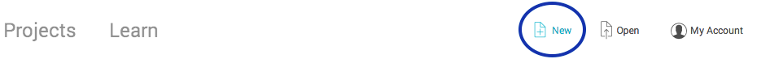
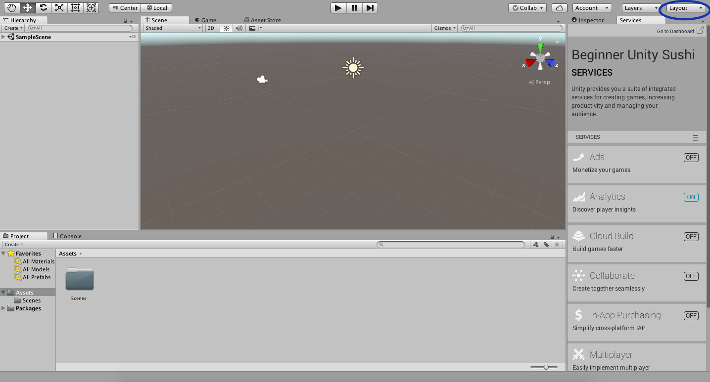
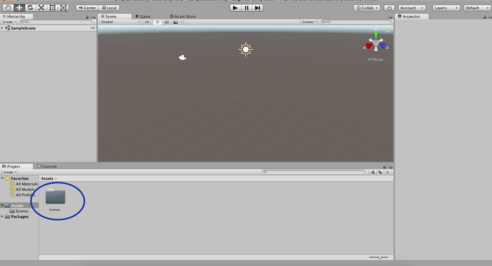

## Maak het speelveld

Voordat je aan de slag kunt gaan met het maken van je game, moet je eerst het een en ander instellen.

+ Start Unity en kies **New** om een nieuw project te creëren.

+ Wanneer je gevraagd wordt om een naam voor het project, noem het dan "Beginner Unity Sushi", zodat het later gemakkelijk te vinden is!

+ Klik op **Create Project** en wacht tot jouw project op het scherm verschijnt!

+ In de rechterbovenhoek van het Unity-venster ziet je een menu met de naam **Layout**. Klik erop en kies **Default**.

  

+ Kijk naar het paneel met de naam **Assets**. Je zou daar een map moeten zien met de naam **`Scenes`**.

  

--- collapse ---
---
title: Er is geen map Scenes
---

Als er geen map is met de naam `Scenes`, kun je deze maken.

+ Ga naar de menubalk (op een Mac staat deze bovenaan het scherm, op een Windows-PC staat deze bovenaan het Unity-venster) en kies het **Assets** menu aan de linkerkant.

+ Selecteer **Create > Folder**, wat betekent dat je de **Create** optie kiest en vervolgens de **Folder** optie in het menu dat hieronder opent.

+ Je wordt gevraagd naar een naam voor je nieuwe map. Noem het `Scenes`.

--- /collapse ---

Het volgende dat je nodig hebt, is een scène. Het blijkt dat je er al een hebt, omdat het Unity-project er met een is begonnen, dus je hoeft het alleen maar op te slaan.

+ Ga naar het hoofdmenu en kies **File > Save Scene as...**. Je moet de scène een naam geven en een locatie kiezen om hem op te slaan. Noem het `MazeRoboBegins` en sla het op in de `Scenes` map die zich bevindt in de `Assets` map.

--- collapse ---
---
title: Je werk opslaan
---

+ Vergeet niet om regelmatig op te slaan, zodat je niet per ongeluk al je harde werk verliest!

+ Klik op **File > Save Scenes** of druk tegelijk op de <kbd>Ctrl</kbd> (<kbd>cmd</kbd> op een Mac!) en <kbd>s</kbd> toetsen.

--- /collapse ---
