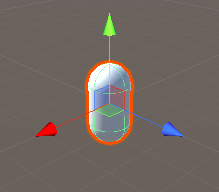
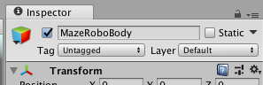
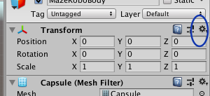
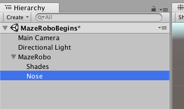
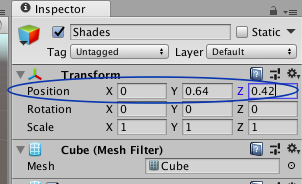
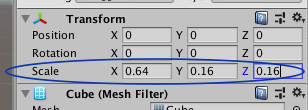
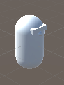

## Maak een robot

Tijd om je eerste object te maken!

+ Maak een **Capsule** object \(**GameObject > 3D Object > Capsule**\): dit wordt het lichaam van MazeRobo, jouw robot!

  

+ Selecteer de capsule door erop te klikken. Aan de rechterkant zou je heel veel opties en menu's moeten zien. Dit heet de **Inspector**, en hier stel je de meeste objecten in je spel in.

Je kunt de naam van een object wijzigen door bovenaan de Inspector een nieuwe naam in te voeren.

+ Verander nu de naam van de Capsule in `MazeRobo`.

  

+ Om er zeker van te zijn dat MazeRobo midden in de gamewereld staat, kijk je in de **Transform** sectie van de Inspector, klik op het tandwielpictogram en kies **Reset**.

  

+ Je hebt nog een paar objecten nodig om je robot te maken, dus maak een **Cube (blok)** \(**GameObject > 3D Object > Cube**\) en een **Sphere (bol)** \(**GameObject > 3D Object > Sphere**\).

+ Wijzig de naam van de Cube in `Shades (zonnebril)`, en de naam van de Sphere in `Nose (neus)`.

+ Kijk aan de linkerkant van het scherm. Je zou een lijst met de objecten in je game moeten zien, inclusief `MazeRobo`, `Shades`, en `Nose`. Klik op `Shades` en sleep het naar `MazeRobo`. Sleep vervolgens `Nose` naar `MazeRobo` op dezelfde manier.

   

--- collapse ---
---
title: Objecten samen slepen
---

Dit zet de `Shades` en `Nose` objecten 'binnen' het `MazeRobo` object, dus als ze bewegen, bewegen ze samen.

Door objecten 'in' andere objecten te plaatsen, kun je complexe objecten \(zoals een spelpersonage!\) samenstellen uit eenvoudige objecten zoals kubussen, bollen, capsules, enz.

--- /collapse ---

+ Selecteer nu het `Shades` object en kijk naar de **Transform** sectie van de Inspector. Je ziet een set van drie **coördinaten** \(X, Y, Z\) die de **Position (positie)** van het object bepalen.

+ Probeer de waarde van elk van de coördinaten te veranderen om te zien welke richting ze bepalen. Probeer ook een `-` voor de getallen! Stel ze ten slotte in op deze waarden:
```
X = 0
Y = 0.64
Z = 0.42
```
  

+ Doe hetzelfde voor `Nose`, stel ze zo in:
```
X = 0
Y = 0.5
Z = 0.5
```
Dit ziet er nog niet helemaal goed uit, toch? Om MazeRobo op een robot te laten lijken, pas je aan hoe de `Shades` en `Nose` eruit zien. Je kunt de vorm van objecten bepalen met de **Scale (schaal)** bedieningselementen.

+ Kijk nog even in de **Inspector**, en bekijk daar de scale bediening voor `Shades`. Stel de schaal in op deze waarden:
```
X = 0.64
Y = 0.16
Z = 0.16
```
  

+ Stel nu de `Nose` schaal in op:
```
X = 0.16
Y = 0.16
Z = 0.16
```
Nu begint het op een robot te lijken!

  

In de volgende stap is het tijd om wat kleur toe te voegen!
