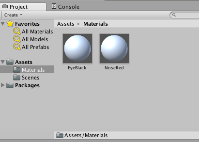
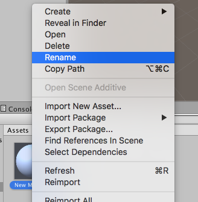
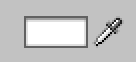
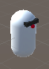
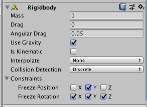

## Voeg een kleur toe

+ Maak een nieuwe map door op ** Assets > Maak > map te klikken ** en noem het ` Materials `.

+ Maak nu twee ** materials ** (** Assets > Create > Material **) genaamd ` EyeBlack ` en ` NoseRed `.

+ De twee nieuwe materialen moeten in de ` Materials` map staan die u zojuist hebt gemaakt in het ** Project ** deelvenster onder aan het scherm. Als ze er niet zijn, sleep ze dan naar de ` Materials ` map om ze erin te plaatsen.

--- collapse ---
---
titel: Dingen hernoemen
---

Je kunt de naam van een materiaal of map wijzigen door er met de rechtermuisknop op te klikken en ** Rename** te selecteren.

--- /collapse ---

+ Je kunt de kleur van een materiaal instellen door de ** albedo ** waarde te wijzigen in de inspecteur. Klik op de rechthoek naast het druppelpictogram en een kleurkiezer zou moeten openen.

+ Maak ` EyeBlack ` 's albedo-waarde zwart en ` NoseRed ` 's albedo waarde rood.

+ Selecteer de ` Zonnebril ` object, kijk naar de ** Mesh Renderer ** sectie van de Inspector en vouw de ** Materialen uit ** onderafdeling. Klik op de kleine cirkel rechts van ** Element 0 ** en selecteer ` EyeBlack `. Nu heeft MazeRobo zwarte zonnebril!

+ Doe hetzelfde voor de ` Neus ` object zoals je deed voor de ` Zonnebril ` object, selecteer nu alleen de ` NoseRed ` materiaal. Nu heb je MazeRobo een rode neus gegeven!

### Je robot regels geven

MazeRobo heeft een ** Rigidbody ** component nodig zodat je haar kunt verplaatsen en haar met de wereld kunt laten communiceren.

+ Selecteer MazeRobo en klik op ** Component > Physics > Rigidbody **. Hiermee kun je regels instellen voor hoe MazeRobo zich gedraagt in het spel.

+ Je zult nu zien dat wanneer je MazeRobo hebt geselecteerd, er een ** Rigidbody ** sectie is in de Inspector. Open de ** -Constraints ** subsectie van de ** Rigidbody ** sectie en stel ** Freeze Rotation X, Y en Z in ** tot ** Waar ** door in alle vakjes te klikken. In ** Freeze Position **, stel ** Y in ** tot ** True ** door op dat vak te klikken.

+ Nu heb je een basis robotkarakter dat je in je spel kunt gebruiken. Je kunt het echt je eigen maken door een paar kleuren te veranderen of er misschien extra stukken aan toe te voegen met meer ** 3D-Objects ** die je kunt positioneren, zoals je deed in de laatste stap! Als je eenmaal tevreden bent met je robot, ga je verder met de volgende stap.
