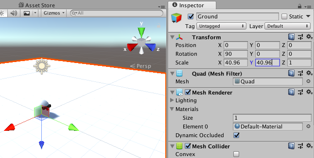
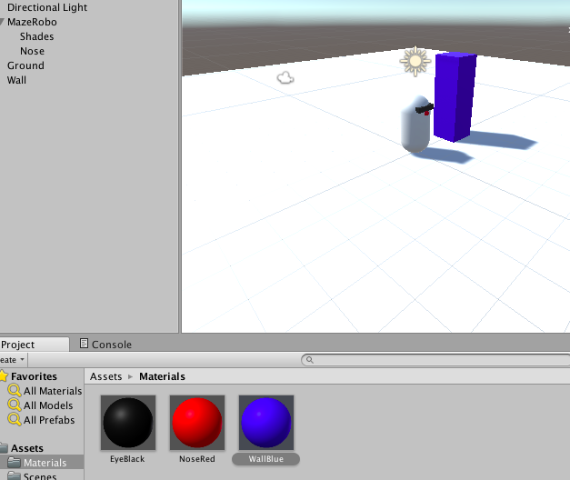

## Maak de grond van je spelwereld

Nu ga je een grondvlak maken voor MazeRobo om verder te gaan!

+ Begin met het toevoegen van een **Quad (vierhoek)** object als de grond (**GameObject > 3D Object > Quad**). Verander de naam van dit object van `Quad` naar `Ground (grond)` in de Inspector.

+ In de Inspector voor dit nieuwe object onder **Transform**, stel de **X Rotation** in op `90`, en voor **Scale**, voer deze waarden in:
```
X = 40.96
Y = 40.96
Z = 1
```

  

Oei! MazeRobo zit halverwege de grond vast! Laten we haar een meter opschuiven.

+ Selecteer MazeRobo en in de Inspector onder **Transform**, stel de volgende **Position** coördinaten in:
```
X = 0
Y = 1
Z = 0
```
  

Nu voeg je een muur toe om je doolhof te starten!

+ Maak een Cube (**GameObject > 3D Object > Cube **) en stel de **Transform Position** in op:
```
X = -2
Y = 1.5
Z = 0 
```
+ Stel de Y **Scale** in op `3` en hernoem het object naar `Wall (muur)`.

+ Maak nu een nieuw materiaal voor `Wall` (**Assets > Create > Materials**), hernoem het `WallBlue`, en verander het albedo om het een (verrassing!) blauwe kleur te geven.

+ Wijs het `WallBlue` materiaal toe aan de `Wall` met behulp van de **MeshRender > Materials** sectie van de Inspector (je kunt het materiaal ook rechtstreeks naar het object slepen).

Later verander je deze muur in een doolhof, zodat MazeRobo deze kan verkennen!


