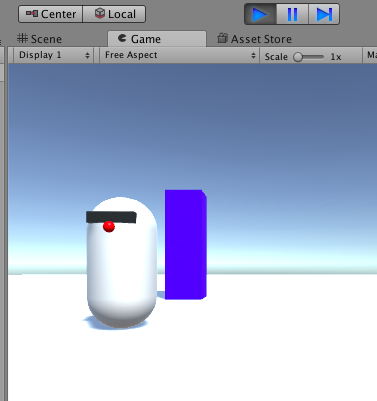

## Goed bewegen

MazeRobo beweegt, maar het is een beetje... raar. Het draait niet om om te zien waar het heen beweegt. Je kunt dat oplossen!

+ Ga terug naar het `RoboMover` script en voeg deze nieuwe regel toe onder `rb.MovePosition`:

```cs
rb.MoveRotation (Quaternion.LookRotation (desiredDirection, Vector3.up));
```

Deze regel laat MazeRobo kijken waar het naartoe gaat.

+ Start het spel en bekijk het!

MazeRobo kijkt waar het naartoe gaat, maar zodra je de knoppen loslaat, springt het weer terug in zijn oorspronkelijke richting. Je kunt dat ook oplossen!

--- collapse ---
---
title: Waarom springt de robot terug naar de andere kant?
---

Het probleem is dat Unity de oorspronkelijke richting van MazeRobo kent als de standaardwaarde `0`, en dus als er geen actieve invoer van de speler is, is de invoer `0`, dus dat is waar robot zich naar richt.

Je moet ervoor zorgen dat MazeRobo alleen draait op basis van actieve spelersinvoer.

De controle die je hiervoor in de code gebruikt, is: **als** de invoer van de speler groter is dan een zeer klein getal \(`0.01`\), **dan** bewegen en draaien. Er gebeurt dus niets voor die standaard `0`.

--- /collapse ---

+ Het eerste dat je moet doen, is al je bestaande code voor het wijzigen van de richting in een `if` instructie zetten, die alleen de code erbinnen uitvoert als de voorwaarde tussen haakjes `waar` is.

```cs
// Update is called once per frame
void Update () {

    if (true) {
      Vector3 desiredDirection = new Vector3 (Input.GetAxis ("Horizontal"), 0.0f, Input.GetAxis ("Vertical"));
      desiredDirection = moveSpeed * desiredDirection;
      desiredDirection = Time.deltaTime * desiredDirection;
      rb.MovePosition (rb.position + desiredDirection);
      rb.MoveRotation (Quaternion.LookRotation (desiredDirection, Vector3.up));
    }
}
```

--- collapse ---
---
title: Wat doet de nieuwe code?
---

Op dit moment dwing je dat de `if` instructie **waar** is door het daadwerkelijk `true` te geven als voorwaarde. Dit betekent dat de code precies zo zal werken als voorheen. Dat verander je zo.

--- /collapse ---

+ Voer het spel uit en controleer of alles nog werkt.

Nu moet je je testvoorwaarden creëren.

+ Boven de `if` instructie, maar nog steeds in de `Update` functie, moet je de spelerinvoer verzamelen en hun **absolute** waarden zoals dit:

```cs
    void Update () {

    float inputHorizontal = Mathf.Abs (Input.GetAxis ("Horizontal"));
    float inputVertical = Mathf.Abs (Input.GetAxis ("Vertical"));

    if (true) {
```

--- collapse ---
---
title: Wat is een absolute waarde en wat doet het?
---

Wanneer je MazeRobo vertelt om verder te gaan, ziet Unity dat als een positief getal \(bijv. `1`\), en als je het vertelt om achteruit te gaan, ziet Unity dat als een negatief getal \(bijv. `-1`\).

Je wilt gewoon testen voor de **grootte** van het getal, ongeacht het teken, daarom gebruik je de absolute waarde van het getal.

De **absolute waarde** is de waarde van het getal zonder het teken, dus het is altijd een positief getal of nul.

--- /collapse ---

Nu is het tijd om de `if` instructie bij te werken zodat het echt iets test! Je moet wijzigen wat er tussen haakjes staat na de `if` zodat het controleert of `inputHorizontal` **groter** is dan `0.01` **of** dat `inputVertical` **groter** is dan `0.01`, en een `waar` resultaat geeft in beide gevallen.

Om dit te doen, moet je een 'of' gebruiken tussen je voorwaarden die je computer kan begrijpen. In C\# \(de taal waarin je je Unity-scripts schrijft\) schrijven we 'of' met twee pijptekens, zoals dit: `voorwaarde A || toestand B`. Er zijn ook andere manieren om aan twee of meer voorwaarden deel te nemen, bijvoorbeeld de operator 'en' \(`&&`\), en je kunt ze online opzoeken als je ze nodig hebt.

+ Om de 'of'-voorwaarde te schrijven die je nodig heeft, werk je gewoon je `if` instructie als volgt bij:

```cs
  if (inputHorizontal > 0.01f || inputVertical > 0.01f) {
```

Nu moet MazeRobo blijven kijken in de richting waarin het net is verplaatst! Als je problemen ondervindt, controleer dan of je `Update` functie overeen komt met deze code:

```cs
void Update () {

  float inputHorizontal = Mathf.Abs (Input.GetAxis ("Horizontal"));
  float inputVertical = Mathf.Abs (Input.GetAxis ("Vertical"));

  if (inputHorizontal > 0.01f || inputVertical > 0.01f) {
    Vector3 desiredDirection = new Vector3 (Input.GetAxis ("Horizontal"), 0.0f, Input.GetAxis ("Vertical"));
    desiredDirection = moveSpeed * desiredDirection;
    desiredDirection = Time.deltaTime * desiredDirection;
    rb.MovePosition (rb.position + desiredDirection);
    rb.MoveRotation (Quaternion.LookRotation (desiredDirection, Vector3.up));
    }
```


