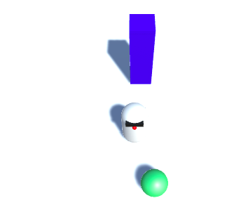

## Geef MazeRobo iets om mee te spelen

Nu je je karakter hebt en het beweegt goed, is het tijd om het iets te geven om mee te spelen! Je gaat een bal toevoegen voor de MazeRobo om rond te duwen.

+ Begin met het maken van een **Sphere (bol)**(**GameObject > 3D-object > Sphere**). Hernoem het `Ball`.

+ Stel de **Transform Position** eigenschap van `Ball` in op:
```
  X: 0
Y: 1
Z: 2
```
+ Maak een ander materiaal (zie de **Kleur toevoegen** stap als je niet meer weet hoe!) en maak het groen. Noem het `BallGreen` en sleep het naar `Ball`!


Als je het spel nu test en MazeRobo de bol in laat lopen, zul je merken dat het zich net als de muur gedraagt: het beweegt niet. Je wilt echter dat de bol een rollende bal is, dus je moet hem een aantal regels geven om te bewegen, zoals MazeRobo heeft.

+ Selecteer `Ball` en geef het een **Rigidbody** component (**Component > Physics > Rigidbody**).

+ Probeer nu te spelen!


