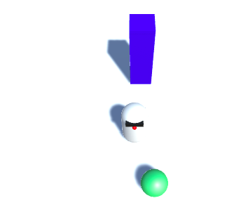

## Give MazeRobo something to play with

Now that you've got your character and it's moving around properly, it's time to give it something to play with! You're going to add a ball for the MazeRobo to push around.

+ Start by creating a **Sphere** (**GameObject > 3D Object > Sphere**). Rename it `Ball`.

+ Set the **Transform Position** property of `Ball` to:
```
  X: 0
  Y: 1
  Z: 2
```
+ Make another material (see the **Add colour** step if you don't remember how!) and make it green. Call it `BallGreen` and drag it onto `Ball`!


If you test the game now and walk MazeRobo into the sphere, you'll notice it behaves just like the wall: it doesn't move. You want the sphere to be a rolling ball though, so you'll need to give it some rules for moving, like MazeRobo has.

+ Select `Ball` and give it a **Rigidbody** component (**Component > Physics > Rigidbody**).

+ Now try playing!


