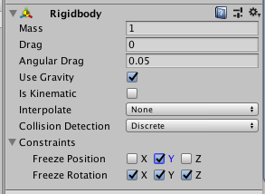

## Add colour

+ Create a new folder by clicking **Assets > Create > Folder**, and call it `Materials`.

+ Now make two **materials** (**Assets > Create > Material**) called `EyeBlack` and `NoseRed`.

+ The two new materials should be in the `Materials` folder you just made, inside the **Project** pane at the bottom of the screen. If they are not there, drag them onto the the `Materials` folder to place them inside it.

--- collapse ---
---
title: Renaming things
---

You can change the name of a material or a folder by right-clicking it and selecting **Rename**.

--- /collapse ---

+ You can set the colour of a material by changing its **albedo** value in the Inspector. Click on the rectangle next to the dropper icon, and a colour picker should open.

+ Make `EyeBlack`’s albedo value black, and `NoseRed`’s albedo value red.

+ Select the `Shades` object, look at the **Mesh Renderer** section of the Inspector, and expand the **Materials** subsection. Click on the small circle to the right of **Element 0** and select `EyeBlack`. Now MazeRobo has black shades!

+ Do the same for the `Nose` object as you did for the `Shades` object, only now select the `NoseRed` material. Now you have given MazeRobo a red nose!

### Giving your robot rules

MazeRobo needs a **Rigidbody** component so that you can move her about and let her interact with the world.

+ With MazeRobo selected, click on **Component > Physics > Rigidbody**. This will let you set rules for how MazeRobo behaves in the game.

+ You'll see now that when you have MazeRobo selected, there's a **Rigidbody** section in the Inspector. Open up the **Constraints** subsection of the **Rigidbody** section, and set **Freeze Rotation X, Y and Z** to **True** by clicking in all the boxes. In **Freeze Position**, set **Y** to **True** by clicking that box.

+ Now you have a basic robot character you can use in your game. You can really make it your own by changing a few colours around, or maybe adding extra pieces to it using more **3D Objects** that you can position, like you did in the last step! Once you're happy with your robot, move on to the next step.
